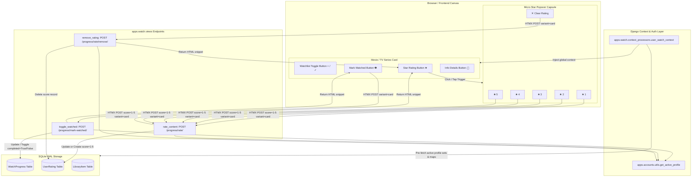
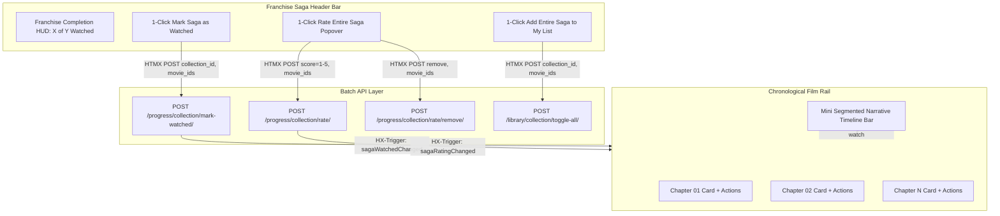

# 🏛️ Filvora Architecture: In-Card Quick Actions & Interaction Engine

This document outlines the architecture, data flow, component hierarchy, and profile isolation mechanisms for Filvora's **In-Card Quick Actions Engine** (1-Click "Mark as Watched", Micro Star Rating Popover, Watchlist Toggle, and Detail Page Parity).

---

## 1. System Architecture Overview

The In-Card Quick Actions Engine enables users to manage their watch progress and submit 1–5 star ratings directly from movie and TV series cards across the catalog (Homepage billboard/rails, Movies browse, TV Series browse, Discover, Search, Recommendations, and History) with zero page navigations.



---

## 2. Component Hierarchy & Real Estate

Each movie and TV series card maintains a bottom action bar with 4 dedicated circular buttons (`w-7 h-7 sm:w-8 sm:h-8`):

```
┌─────────────────────────────────────────────────────────────┐
│                       POSTER ARTWORK                        │
│                                                             │
│  [★ 8.4] [PG-13]                                 [ Seen ]   │
│                                                             │
│                          ( ▶ )                              │
│                        Play Now                             │
│                                                             │
│  ─────────────────────────────────────────────────────────  │
│    [ + ]            [ 👁 ]           [ ★ 4 ]         [ ⓘ ]  │
│  Watchlist         Watched         Quick Rate       Details │
└─────────────────────────────────────────────────────────────┘
```

### 2.1 Action Row Specifications

| Action | Idle / Unset State | Active / Set State | Interaction & Target |
|---|---|---|---|
| **1. Watchlist Toggle** | Dark glassmorphic button with `+` icon (`title="Add to My List"`) | Brand red button with checkmark icon (`title="Saved in My List"`) | HTMX `POST /library/toggle/` with `variant="card"`. Swaps button `outerHTML`. |
| **2. Mark as Watched** | Dark button with SVG eye outline (`title="Mark as Watched"`) | Vibrant emerald button (`bg-emerald-600`) with solid eye icon (`title="Watched (Click to unmark)"`) | HTMX `POST /progress/mark-watched/` with `variant="card"`. Swaps button `outerHTML`. |
| **3. Quick Star Rating** | Dark button with amber star outline (`title="Rate with stars"`) | Gold-accented button (`bg-yellow-500/20 text-yellow-400`) with solid star + score badge (`★ 4`) | Toggles micro glassmorphic popover capsule. HTMX `POST /progress/rate/`. Swaps container `outerHTML`. |
| **4. Info Details** | Dark glassmorphic button with `ⓘ` icon (`title="View Details"`) | Same | Direct anchor link to `/movies/<id>/` or `/series/<id>/`. |

---

## 3. Micro Star Rating Popover Mechanics

The star rating popover capsule floats immediately above the card footer inside the card's boundary (`aspect-[2/3]` container), ensuring clean presentation without layout shifting or edge clipping:

```
                  ╭─────────────────────────────────╮
                  │  ★ 1   ★ 2   ★ 3   ★ 4   ★ 5  │ ✕ │
                  ╰────────────────▼────────────────╯
                      [ + ]     [ 👁 ]   [ ★ ]   [ ⓘ ]
```

### 3.1 Interaction Sequence
1. **Trigger**: User clicks or taps `[★]` on the card.
   - `event.preventDefault()` and `event.stopPropagation()` prevent triggering card links or opening the player.
   - Any currently open popover on another card is automatically dismissed.
   - Popover transitions smoothly into view (`.quick-rate-popover`).
2. **Hover Preview**:
   - Hovering over any star (e.g. Star 4) illuminates stars 1 through 4 in vivid yellow (`text-yellow-400`).
   - Moving the pointer off the popover restores the stars to the active saved score (or unrated gray).
3. **Submission**:
   - Clicking a star sends an HTMX POST request to `/progress/rate/` with `{"tmdb_id": id, "media_type": type, "score": score, "variant": "card"}`.
   - Backend saves or updates the rating under the active profile and returns the rendered `card_rating_button.html`.
   - The popover closes automatically, and the card's star button updates to reflect the new rating with a golden score badge (`★ 5`).
4. **Clearing a Rating**:
   - If a rating exists, a subtle vertical divider and clear button (`✕`) are displayed.
   - Clicking `✕` sends `POST /progress/rate/remove/` with `variant="card"`, resetting the card button to the default unrated state.
5. **Outside Dismissal**:
   - A global pointerdown listener (`document.addEventListener('pointerdown', ..., true)`) detects clicks outside any `.quick-rate-wrapper` and hides open popovers immediately.

---

## 4. Backend Endpoints & Multi-Profile Architecture

All endpoints enforce authentication (`@login_required`) and resolve the session's active profile (`get_active_profile(request)`):

### 4.1 Endpoint Reference

#### `POST /progress/mark-watched/` (`apps.watch.views.toggle_watched`)
- **Parameters**: `tmdb_id` (int), `media_type` ('movie' | 'tv'), `variant` ('card' | 'detail').
- **Behavior**:
  - Queries `WatchProgress` for `(user, profile, tmdb_id, media_type)`.
  - If record exists and `completed == True`:
    - Deletes record (if completed via quick action) or sets `completed = False`.
    - Returns `is_watched = False`.
  - If record does not exist or `completed == False`:
    - Creates or updates `WatchProgress` with `completed = True, position_seconds = 7200.0, duration_seconds = 7200.0`.
    - Returns `is_watched = True`.
- **Response**:
  - HTMX (`HX-Request: true`): renders `components/card_watch_button.html` or `components/detail_watch_button.html`.
  - JSON: `{"status": "ok", "is_watched": boolean}`.

#### `POST /progress/rate/` (`apps.watch.views.rate_content`)
- **Parameters**: `tmdb_id` (int), `media_type` ('movie' | 'tv'), `score` (int 1–5), `variant` (optional: 'card').
- **Behavior**:
  - Validates `1 <= score <= 5`.
  - `UserRating.objects.update_or_create(user, profile, tmdb_id, media_type, defaults={'score': score})`.
- **Response**:
  - HTMX with `variant='card'`: renders `components/card_rating_button.html`.
  - HTMX default: renders `components/rating_stars.html`.
  - JSON: `{"status": "ok", "score": score, "created": boolean}`.

#### `POST /progress/rate/remove/` (`apps.watch.views.remove_rating`)
- **Parameters**: `tmdb_id` (int), `media_type` ('movie' | 'tv'), `variant` (optional: 'card').
- **Behavior**:
  - Deletes matching `UserRating` record for active profile.
- **Response**:
  - HTMX with `variant='card'`: renders `components/card_rating_button.html` with `current_rating=0`.
  - HTMX default: renders `components/rating_stars.html` with `rating_score=0`.
  - JSON: `{"status": "ok", "message": "Rating removed"}`.

---

## 5. Universal Context Processor & Template Helpers

### 5.1 `apps.watch.context_processors.user_watch_context`
Registered globally in `config/settings.py` `TEMPLATES[0]['OPTIONS']['context_processors']`. For any authenticated user, executes indexed SQLite queries to provide:
- `user_watched_movie_ids`: `Set[int]` — TMDB IDs of completed movies for active profile.
- `user_watched_tv_ids`: `Set[int]` — TMDB IDs of completed TV series for active profile.
- `user_watched_ids`: `Set[int]` — Union of completed movie and TV IDs.
- `user_movie_ratings`: `Dict[int/str, int]` — Active profile rating map for movies (`{tmdb_id: score}`).
- `user_tv_ratings`: `Dict[int/str, int]` — Active profile rating map for TV series (`{tmdb_id: score}`).
- `user_ratings`: `Dict[int/str, int]` — Combined rating map.
- `user_saved_ids`: `Set[int]` — Universal fallback for library saved items.

### 5.2 `apps.watch.templatetags.watch_tags.get_item`
Safe template filter allowing dictionary lookup with automatic integer and string key fallback:
```django


    

```

---

## 6. Separation of Signals Guarantee

In Filvora, **Watch Progress** and **User Ratings** represent distinct, independent taste signals:
- **Watching Content** (`WatchProgress`, `completed=True`): Tracks streamed titles. Drives recommendations with *"Because You Watched [Title]"* phrasing.
- **Rating Content** (`UserRating`, 1–5 stars): Reflects personal taste affinity regardless of where the title was watched. Drives recommendations with *"Because You Loved [Title]"* (5 stars) or *"Because You Liked [Title]"* (4 stars).
- By providing separate, dedicated in-card buttons (`[👁]` and `[★]`), users can rate titles they watched elsewhere without generating false stream progress, or mark titles as watched without assigning star ratings.

---

## 7. Verification & Automated Test Coverage

The In-Card Quick Actions Engine is verified by automated unit and integration tests across `apps/watch/tests.py`, included in the master test suite:

- `test_toggle_watched_mark_and_unmark_movie`: verifies 1-click toggle on/off for movies.
- `test_toggle_watched_tv_series`: verifies 1-click toggle for TV series.
- `test_toggle_watched_htmx_card_variant`: verifies HTMX card variant outerHTML swap, CSS classes, and tooltip attributes.
- `test_toggle_watched_htmx_detail_variant`: verifies HTMX detail view parity button and badge states.
- `test_rate_content_card_variant_htmx`: verifies rating content with `variant='card'` swaps the capsule and updates the score badge.
- `test_remove_rating_card_variant_htmx`: verifies removing rating with `variant='card'` resets to unrated state.
- `test_multi_profile_watch_context_processor`: verifies strict profile isolation of watched sets and rating maps.

Execute the full suite with:
```powershell
.\venv\Scripts\python.exe run_all_tests.py
```
Total test suite: **155 tests, 100% passing**.

---

## 8. Franchise Saga & Complete Collection Batch Actions Engine

### 8.1 Overview
The Franchise Saga & Complete Collection Engine extends individual quick actions to entire cinematic universes (e.g. *Dune Collection*, *The Dark Knight Trilogy*, *Spider-Man Spider-Verse*, *John Wick Collection*, *Harry Potter*). Users can mark an entire franchise as watched, rate all installments with 1–5 stars simultaneously, or add the whole saga to their personal list with zero page navigations.



### 8.2 Endpoints & Capabilities
1. `POST /progress/collection/mark-watched/` (`toggle_collection_watched`):
   - Toggles all movies in collection as completed (`WatchProgress`) for active profile.
   - If already completely watched, unmarks all.
   - Returns updated `templates/components/collection_actions_bar.html` with `HX-Trigger: {"sagaWatchedChanged": ...}`.
2. `POST /progress/collection/rate/` (`rate_collection`):
   - Assigns 1–5 star rating across all movies in franchise for active profile (`UserRating`).
   - Returns updated collection bar with `HX-Trigger: {"sagaRatingChanged": ...}`.
3. `POST /progress/collection/rate/remove/` (`remove_collection_rating`):
   - Clears star ratings across all movies in the collection for active profile.
4. `POST /library/collection/toggle-all/` (`toggle_collection_library`):
   - Batch adds/removes all franchise installments in `LibraryItem` for active profile.
   - Returns updated collection bar with `HX-Trigger: {"sagaLibraryChanged": ...}`.

### 8.3 In-Card Parity in Saga Rails
Every movie card in the Official Franchise Saga rail is equipped with:
- Desktop & mobile permanent `Seen` emerald indicator when completed.
- Center Play button.
- 4 dedicated in-card actions: `[+]` Add to My List, `[👁]` Mark as Watched, `[★]` Quick Star Rating popover, and `[ⓘ]` Details.
- Real-time client DOM synchronization (`sagaWatchedChanged`, `sagaRatingChanged`) updating cards and timeline ribbon without requiring page reloads.

### 8.4 Automated Test Suite
- `test_toggle_collection_watched_batch` (`apps.watch`): verifies batch marking and unmarking entire sagas.
- `test_rate_collection_batch` (`apps.watch`): verifies assigning 5 stars across franchise parts.
- `test_remove_collection_rating_batch` (`apps.watch`): verifies batch rating removal.
- `test_toggle_collection_library_batch` (`apps.library`): verifies batch watchlist toggle and profile isolation.
